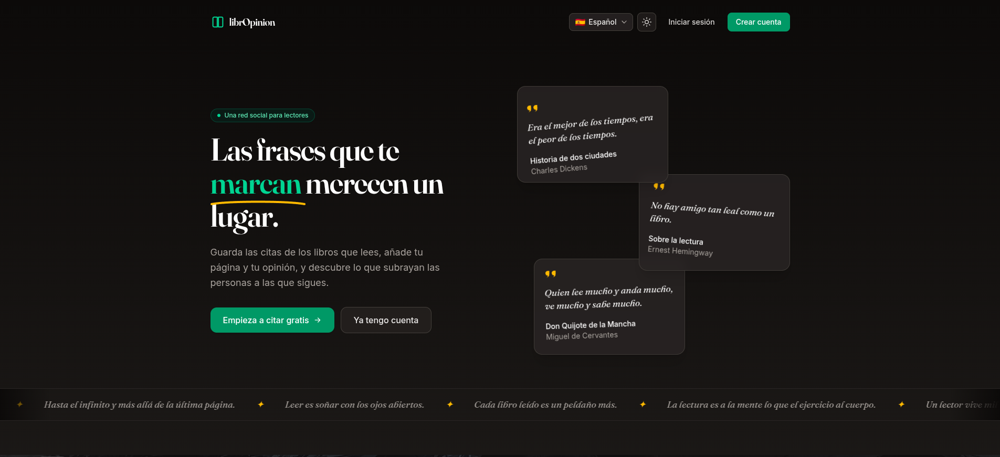
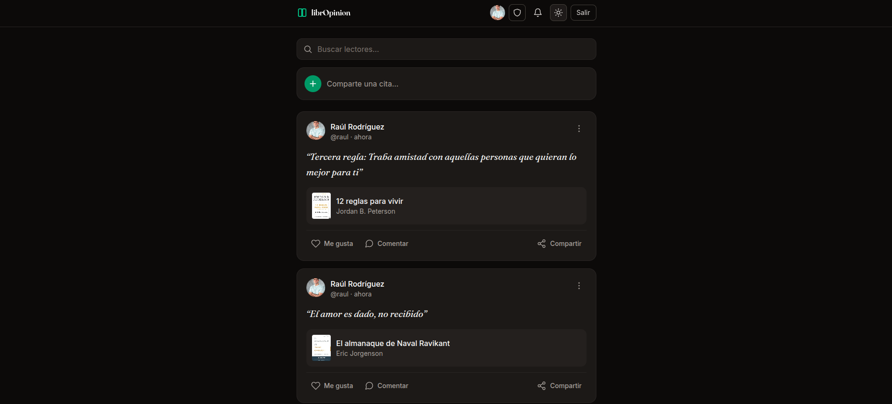
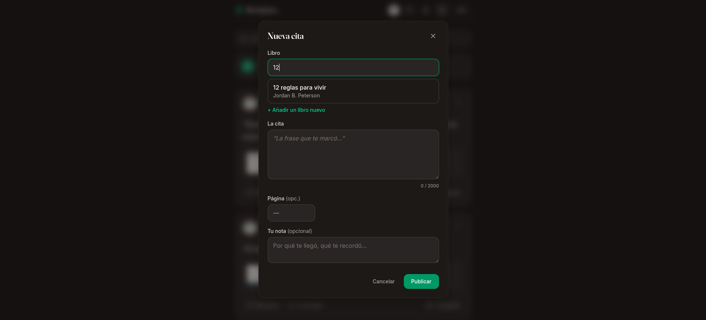
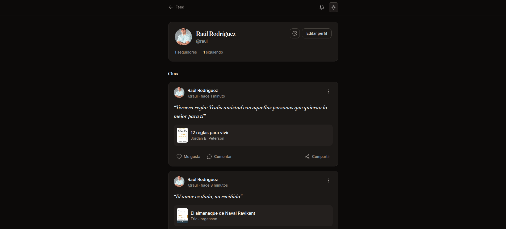
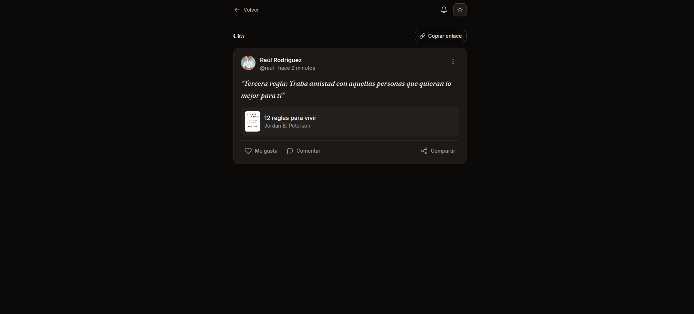
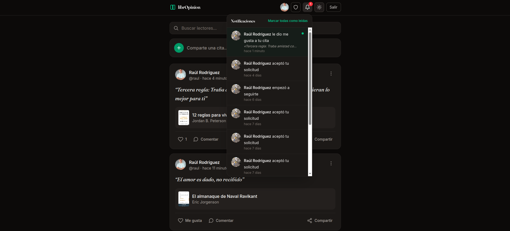
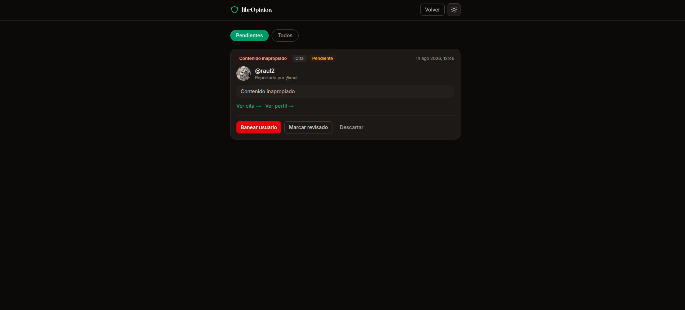
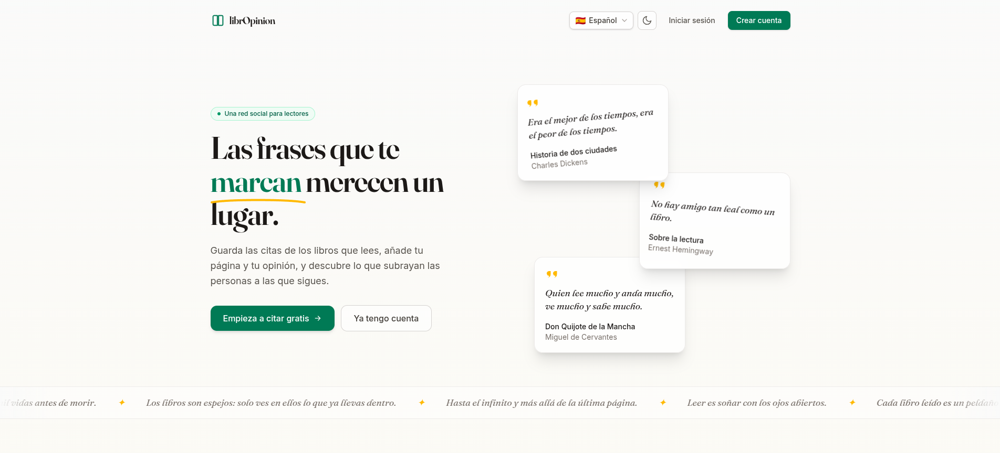
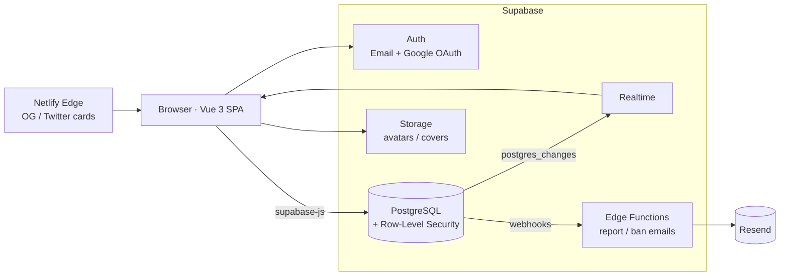

# 📖 librOpinion

### The social network for the lines that stay with you.

*A Twitter-style social network where every post is a **book quote**. Save the passages that move you, add your page and your take, and discover what the people you follow are underlining.*

<!-- ─────────────────────────────────────────────────────────────
     SCREENSHOT: Landing page (light mode). Recommended: docs/screenshots/landing.png
     ───────────────────────────────────────────────────────────── -->

  

---

## ✨ What is librOpinion?

You read a book, you underline the sentences that stick — and then they live forgotten in a drawer. **librOpinion** turns those quotes into a feed: publish a passage (with its book, page and your own note), follow other readers, and see their highlights in real time. Think of it as a reading-first social network built around ideas instead of hot takes.

Built as a full-stack project with **Vue 3 + TypeScript** on the front and **Supabase** (PostgreSQL, Auth, Row-Level Security, Realtime, Storage and Edge Functions) on the back — with **RLS as the single security boundary**, not client-side checks.

> 🔗 **Live demo:** _coming soon on Netlify_ · _(add your URL here once deployed)_

---

## 📸 Screenshots

<!-- Capture these views and drop the PNGs in docs/screenshots/. Two per row looks great on GitHub. -->
<table>
  <tr>
    <td width="50%">
<em>Home feed</em>
</td>
    <td width="50%">
<em>Publish a quote</em>
</td>
  </tr>
  <tr>
    <td width="50%">
<em>Reader profile</em>
</td>
    <td width="50%">
<em>Quote permalink</em>
</td>
  </tr>
  <tr>
    <td width="50%">
<em>Live notifications</em>
</td>
    <td width="50%">
<em>Moderation panel</em>
</td>
  </tr>
  <tr>
    <td width="50%">
<em>Share a quote as an image</em>
</td>
    <td width="50%">
<em>Light mode, too</em>
</td>
  </tr>
</table>

---

## 🚀 Features

### 🔐 Authentication & onboarding
- Email + password **and** Google OAuth (Supabase Auth).
- Automatic profile creation via a database trigger; a dedicated **onboarding** step to pick a unique `username`.

### 📚 The reading feed
- Publish quotes with **book, page and a personal note**; a collaborative **book catalog** (search an existing title/author or create a new one, cover included).
- A feed of the quotes from the people you follow **and your own**, newest first.
- **Likes** and **threaded comments**, with optimistic UI.

### 🔎 Discovery
- An in-feed **“Explore the community”** block plus a **“Who to follow”** slider of readers you don't follow yet.
- **True infinite scroll** across the whole app, with a playful end-of-list flourish.

### 👥 Social graph & privacy
- Follow / unfollow, **follower & following lists**, follower counts.
- **Public / private accounts**: private profiles turn follows into **requests** you accept or reject — enforced by RLS, not just the UI.
- **Block** users (bidirectional content hiding).

### 🔔 Real-time everything
- New quotes, likes and comments stream into the UI live (Supabase Realtime).
- **Notifications** (follow, like, comment, follow-request, follow-accepted) with a bell, unread badge and live insert/delete — filtered per-recipient at the database level.

### 🖼️ Sharing
- **Share any quote as a beautiful “paper & ink” image**, generated entirely in the browser via Canvas — it **matches the current light/dark theme** and carries the librOpinion signature. Uses the Web Share API on mobile, downloads on desktop.
- **Public permalinks** (`/q/:id`) readable without an account, plus **Open Graph / Twitter cards** injected at the edge so links unfurl nicely when shared.

### 🛡️ Moderation
- Any user can **report** a profile, quote or comment; reports land in a table and trigger an **email to the admin** (Resend via Supabase Edge Function).
- A protected, admin-only **moderation panel** to review reports and **ban / unban** with a reason.
- Banning **hides the user's content, blocks their writes *and* their reads** (RLS), shows them a “Suspended account” screen live, and **emails them the reason** — with a friendly “account restored” email on unban.

### 🌍 Multi-language
- Fully **bilingual UI (English & Spanish)** — every screen, form placeholder, error message and relative date is translated, with no hardcoded strings.
- **Auto-detects** the browser language on first visit (Spanish browsers → Spanish, everything else → English) and lets you switch anytime from an in-app **Settings** dialog.
- Your choice is **saved to your profile**, so it follows you across devices.

### 🎨 Craft
- Global **dark mode** (system-aware, no flash-of-unstyled-content), an animated **landing page** (“paper & ink” theme, `prefers-reduced-motion` aware), and a clean, responsive UI throughout.

---

## 🧱 Tech stack

| Layer | Tech |
|---|---|
| **Frontend** | Vue 3 (`<script setup>`, Composition API), TypeScript (strict) |
| **Build** | Vite 8 |
| **Styling** | Tailwind CSS 4 (`@tailwindcss/vite`) |
| **Routing** | Vue Router |
| **State** | Pinia (auth session only) · composables for everything else |
| **i18n** | vue-i18n (English / Spanish, browser detection, profile-persisted) |
| **Backend** | Supabase — PostgreSQL, Auth, Row-Level Security, Realtime, Storage |
| **Serverless** | Supabase Edge Functions (Deno) + **Resend** for transactional email |
| **Edge/OG** | Netlify Edge Function for Open Graph tags |

---

## 🏗️ Architecture

**Design principles**

- **RLS is the security boundary.** The client never re-implements permission checks or trusts a hand-passed `user_id`; it simply queries and lets Row-Level Security filter. The “feed of who I follow” is *query logic*, not a security rule.
- **Reusable visibility gate.** A single `can_view_author(uuid)` SQL function centralizes “can the current user see this author's content?” (own / public / accepted follower / not blocked / not banned) and is reused across `quotes`, `likes` and `comments` policies.
- **Privileged actions via `security definer` RPCs.** Banning, follow-status and notification inserts run through audited functions that verify the caller (e.g. `is_admin()`) — never an open `UPDATE`.
- **Pinia only for the auth session.** All other state lives in focused composables (`useFeed`, `useNotifications`, `useProfile`…), many as module-level singletons.

---

## 🔒 Security highlights

- **Row-Level Security on every table**, with policies split by role (`anon` vs `authenticated`).
- **Public permalinks without leaking private data** — anonymous reads are allowed *only* for public, non-banned authors, reusing the same `can_view_author` gate.
- **Full ban lockdown** — a banned user can't write, can't be seen, *and* can't read (their API queries return empty), while still being able to load their own profile so the app can show the suspension screen.
- **Admin role is not self-grantable** — there is deliberately no UI to grant it; it's set directly in the database.
- **No secrets in the repo** — all keys live in `.env` (git-ignored) and Supabase/Netlify secrets.

---

## 🗺️ Roadmap

- [x] Auth (email + Google), feed, quotes, profiles, follows
- [x] Likes, comments, storage, realtime, notifications
- [x] Discovery, follower lists, permalinks, infinite scroll
- [x] Public / private accounts & follow requests
- [x] Blocking, reports, bans, admin panel & email notifications
- [x] Share-as-image & public Open Graph permalinks
- [x] Bilingual UI (English / Spanish) with in-app settings
- [ ] Verify OG previews on the live Netlify deployment
- [ ] Verified sending domain (send moderation emails to any user)
- [ ] Custom domain (Hostinger)

---

## 👤 Author

**Raúl** — Full-stack developer

- GitHub: [@sudoRaul](https://github.com/sudoRaul)
- Email: raul.rodriguez@infiniton.es
- LinkedIn: [Raúl Rodríguez Fernández](https://www.linkedin.com/in/ra%C3%BAl-rodr%C3%ADguez-fern%C3%A1ndez-393b05339/)

---

*Built with Vue, TypeScript and Supabase — and a lot of good quotes.*

